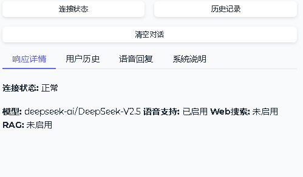
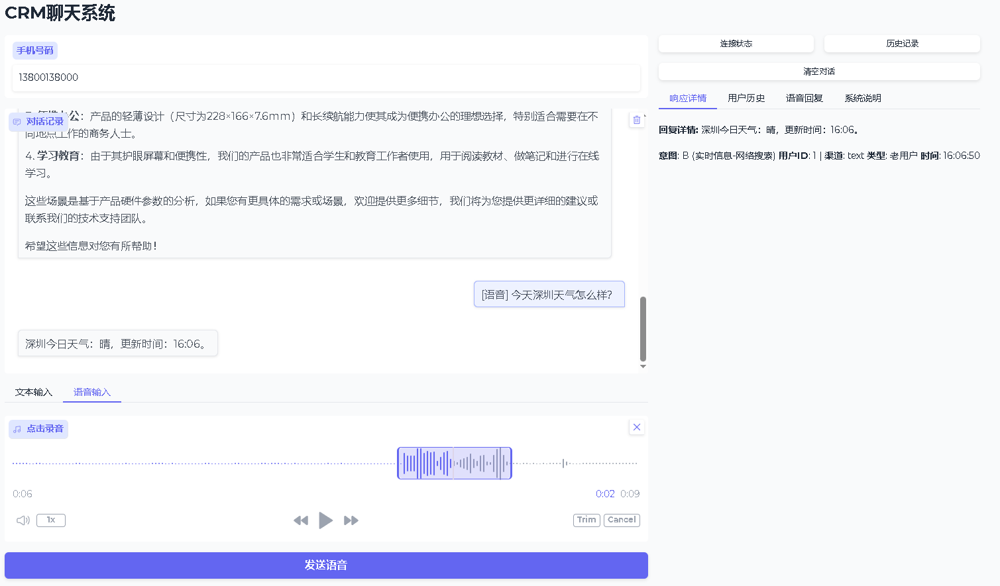
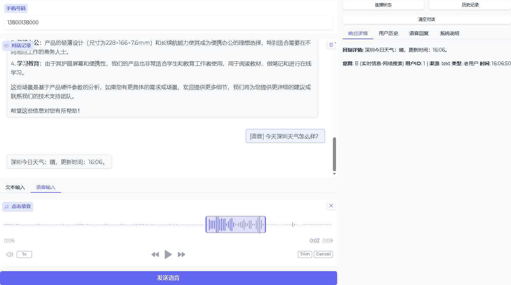
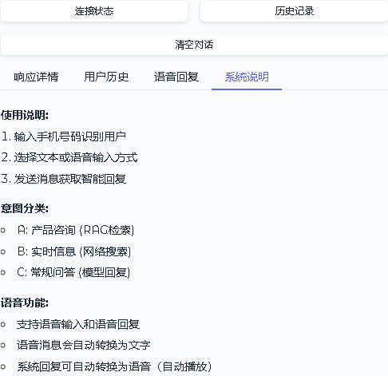

### 1. 项目概述

#### 1.1 项目简介

CRM智能语音助手系统是一个集成了文本聊天、语音交互和客户关系管理功能的一体化解决方案。系统支持：

* 文本聊天（API和Web界面）
* 语音聊天（语音识别、语音合成）
* 用户管理（基于手机号码）
* 意图识别（A/B/C三类意图）
* 多渠道对话记录存储

#### 1.2 核心功能

1. **双模式交互** ：支持文本和语音两种输入方式
2. **意图识别** ：自动识别用户意图并分派处理逻辑
3. **语音处理** ：集成阿里云ASR/TTS服务
4. **用户管理** ：基于手机号码的用户识别和对话历史管理
5. **Web界面** ：Gradio构建的友好用户界面

### 2. 系统架构

#### 2.1 架构图

**text**

```
┌─────────────────────────────────────────────┐
│            Gradio Web界面 (7860端口)        │
│    (gradio_interface.py)                    │
└─────────────────┬───────────────────────────┘
                  │ HTTP请求
┌─────────────────▼───────────────────────────┐
│           Flask API服务器 (8003端口)        │
│            (app.py)                         │
└─────┬────────────┬────────────┬─────────────┘
      │            │            │
┌─────▼────┐ ┌─────▼────┐ ┌─────▼────┐
│响应引擎  │ │语音处理器│ │数据库    │
│(response_│ │(voice_   │ │(database │
│engine.py)│ │processor)│ │ .py)     │
└─────┬────┘ └─────┬────┘ └──────────┘
      │            │
┌─────▼────┐ ┌─────▼────┐
│意图识别  │ │统一处理器│
│(intent_  │ │(unified_ │
│recognizer)││processor)│
└──────────┘ └──────────┘
```

#### 2.2 技术栈

* **后端框架** ：Flask + FastAPI
* **前端界面** ：Gradio
* **数据库** ：SQLite
* **LLM模型** ：DeepSeek-V2.5（这里通过SiliconFlow） + 阿里云千问
* **语音服务** ：阿里云ASR/TTS
* **部署方式** ：本地部署

### 3. 配置说明

#### 3.1 环境变量配置 (.env)

**bash**

```
# LLM配置
MODEL_NAME=deepseek-ai/DeepSeek-V2.5
LLM_TEMPERATURE=0.3
openai_api_key=sk-your-siliconflow-key

# 服务器端口
SERVER_HTTP_PORT=5000
GRADIO_PORT=7860
FASTAPI_PORT=8000

# 阿里云语音配置
ASR_ACCESS_KEY_ID=your_asr_key
ASR_ACCESS_KEY_SECRET=your_asr_secret
ASR_APPKEY=your_asr_appkey
TTS_ACCESS_KEY_ID=your_tts_key
TTS_ACCESS_KEY_SECRET=your_tts_secret
TTS_APPKEY=your_tts_appkey
TTS_VOICE=xiaoyun

# 阿里云LLM配置
LLM_API_KEY=your_aliyun_llm_key
LLM_MODEL=qwen-turbo
```

#### 3.2 依赖安装

**bash**

```
# 安装Python依赖
pip install -r requirements.txt

# 主要依赖包
# requirements.txt 应包含：
flask==2.3.3
gradio==4.14.0
openai==1.3.0
sqlite3
python-dotenv==1.0.0
uvicorn==0.24.0
fastapi==0.104.1
aiohttp==3.9.1
wave
hmac
hashlib
```

### 4. 部署指南

#### 本地部署

**bash**

```
# 1. 克隆项目
git clone <repository-url>
cd crm-voice-assistant

# 2. 安装依赖
pip install -r requirements.txt

# 3. 配置环境变量
cp .env.example .env
# 编辑.env文件，填入您的API密钥

# 4. 启动服务
python app.py

# 5. 访问Web界面
# 浏览器打开：http://localhost:7860

# 6.可以运行测试脚本test\test_api_with_audio.py进行测试
# test目录下
test\create_test_audio.py  运行后在test_audio_local目录下生成测试语音
test\test_api_with_audio.py   运行后生成文件夹response_audio，并在文件夹里保存机器人的聊天语音
```

### 5. 意图识别逻辑

#### 5.1 意图分类

| 代码 | 类型     | 处理方式      |
| ---- | -------- | ------------- |
| A    | 产品咨询 | RAG知识库检索 |
| B    | 实时信息 | 网络搜索      |
| C    | 常规问答 | 模型直接回复  |

#### 5.2 识别流程

1. 用户输入文本
2. LLM分析意图（A/B/C）
3. 根据意图分派处理逻辑
4. 生成相应回复

### 6. 语音处理流程

#### 6.1 语音转文本（ASR）

```
用户语音 → 阿里云ASR → 识别文本 → 意图识别 → 生成回复
```

#### 6.2 文本转语音（TTS）

```
文本回复 → 阿里云TTS → 音频文件 → 返回用户
```

#### 6.3 音频格式要求

* 采样率：16000 Hz
* 声道：单声道
* 编码：PCM 16bit
* 格式：WAV

### 7.运行截图

#### 7.1 状态检查



#### 7.2 聊天对话

本地检索


实时信息搜索



#### 7.3 用户历史

老用户



新用户


#### 7.4 系统说明


